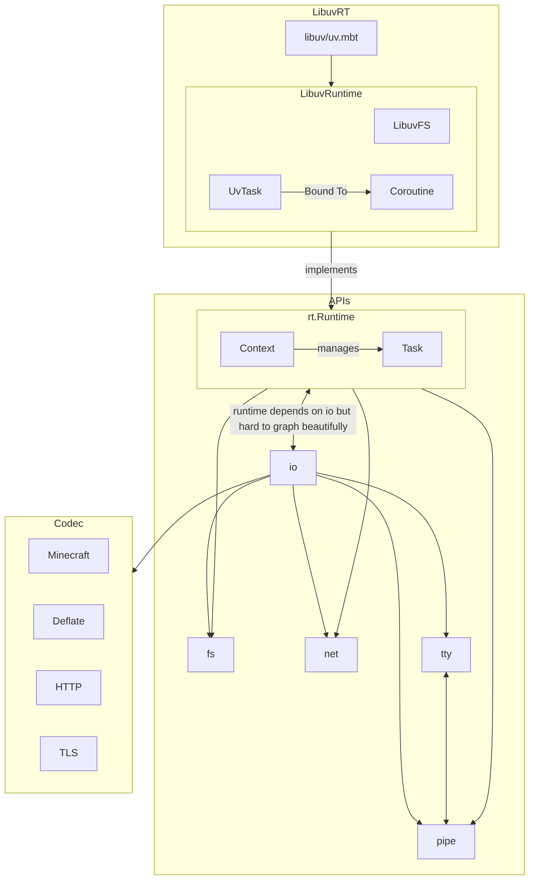
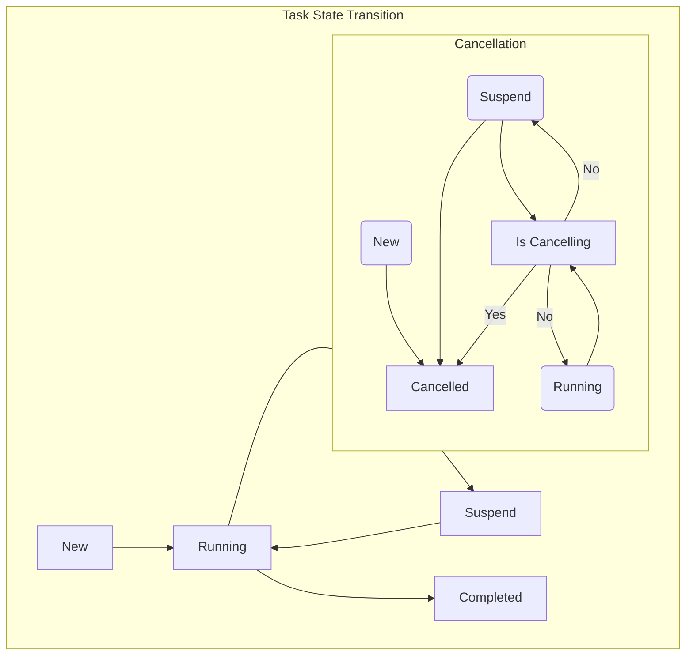
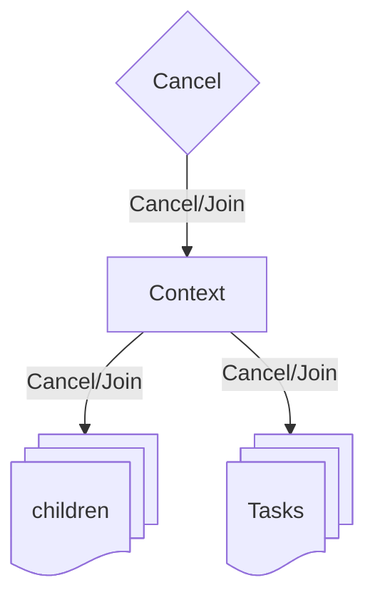

# miao

MIAO~ stands for Moonbit Input And Output. It is a seriously maintained I/O library with wishes to compete with the official async runtime implementation.

It consists of `rt` (runtime), `fs` (filesystem) and `codec` (data encoding and decoding, possibly networking clients). We also targets Network I/O but, like other libraries, are under heavy construction and may change rapidly.

Project status: https://github.com/orgs/kalculos/projects/4

This project uses [version evolution](https://github.com/saltedfishclub/documents/blob/main/Evolution_EN.md) strategy from saltedfishclub, with an additional complement:
 - For a new version, _every_ package in this repository are published simultaneously.

# status

(Well, sorry for my poor english.)

 - io: The base building block of the library. It consists of common abstractions such as Reader and Writer, as well as utilities such as ByteBufReader and LimitedReader.  
    _Status: Mostly stable._
 - rt: The runtime abstraction of the library, which is the gateway to the actual 'world', i.e. the clock, file system access, sleep() or some stub implementations intended for testing.
    It also defines how structured concurrency is implemented (consisting of Job, Task and Context). Currently, Miao has only one runtime implementation, which is backed by the well-known libuv.  
   _Status: The abstraction is stable. This module is updated whenever new APIs are added to Miao, so it is constantly changing._
 fs: Filesystem abstraction with an OO-style path, similar to the nio path in Java. It is designed as a trait to support use cases like ZipFS and InMemFS (for testing).
    It supports the most common file operation usages and is mostly implemented by the libuv runtime.  
   _Status: Some minor cases are not yet covered. Designed by @iceBear67 and reviewed by @hanbings, who is also responsible for subsequent maintenance._
 - mccodec: a headless Minecraft client for Java Edition 1.21.8. It is being developed alongside miao to gather API ideas and adopt new APIs rapidly. We are developing mccodec and the rest of Miao in parallel.  
   _Status: Most of the packet definitions and serialisers have been completed, although there is room for improvement in terms of API usability._  
   The project is maintained by @Sehouz and reviewed by @iceBear67.
 - pipe and buffer  
    The `pipe` and `buffer` modules are a very specific type of `io` utility. 'pipe' provides an 'asynchronous blocking queue' implementation that allows the libuv runtime to bridge reactive-style APIs to a 'blocking' API style semantically. 'buffer' is a redesignation of 'iceBear67/bytebuf' (previously used), with API improvements to enable enhanced performance in the future.  
 - process: This module relates to subprocess management and stdio.    

# Some graphs
that may change in fuuuture

