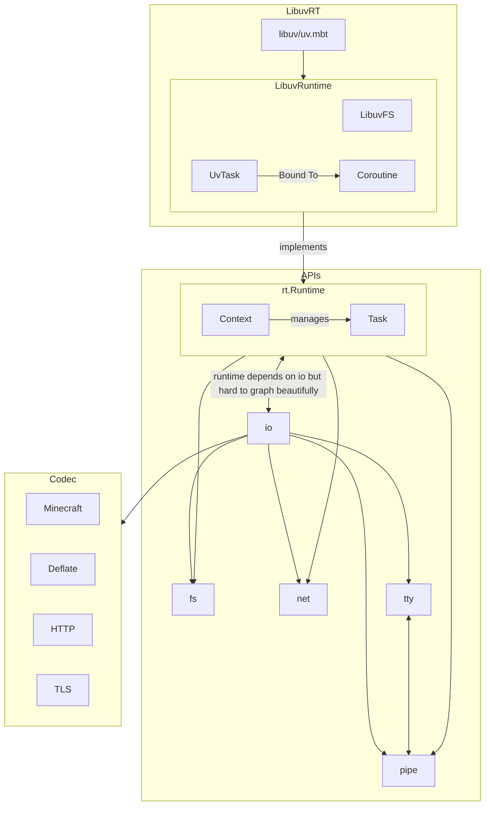
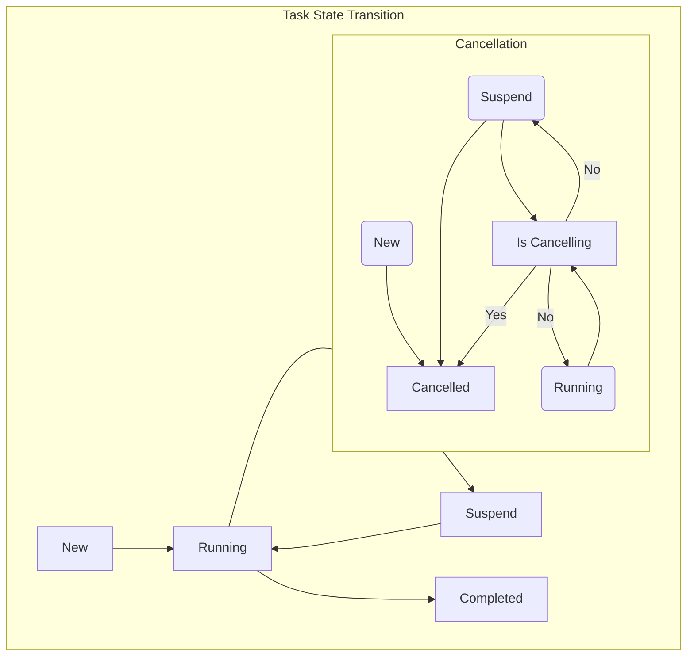

# miao

MIAO~ stands for Moonbit Input And Output. It is a well-designed and general purposed I/O library with portable runtime support. 

It consists of `rt` (runtime), `fs` (filesystem) and `codec` (data encoding and decoding, possibly networking clients). We also targets Network I/O but, like other libraries, are under heavy construction and may change rapidly.

Project status: https://github.com/orgs/kalculos/projects/4

This project uses [version evolution](https://github.com/saltedfishclub/documents/blob/main/Evolution_EN.md) strategy from saltedfishclub, with an additional complement:
 - For a new version, _every_ package in this repository are published simultaneously.

# Some graphs
that may change in fuuuture

